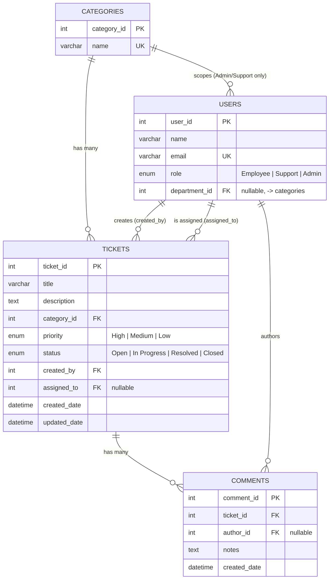

# Database Schema & Design

MySQL 8.0 schema for the Smart Employee Service Desk & Ticket Management
Portal. Source of truth: [`backend/sql/schema.sql`](../backend/sql/schema.sql)
(table definitions) and [`backend/sql/seed.sql`](../backend/sql/seed.sql)
(sample data). This document explains the same schema visually and in
narrative form.

---

## Entity-Relationship Diagram



---

## Tables

### `categories` — departments
| Column | Type | Constraints |
|--------|------|-------------|
| `category_id` | `INT` | PK, auto-increment |
| `name` | `VARCHAR(100)` | `NOT NULL`, `UNIQUE` |

5 seeded rows: IT, HR, Facilities, Finance, Access Management.

### `users` — employees, support staff, department admins
| Column | Type | Constraints |
|--------|------|-------------|
| `user_id` | `INT` | PK, auto-increment |
| `name` | `VARCHAR(120)` | `NOT NULL` |
| `email` | `VARCHAR(160)` | `NOT NULL`, `UNIQUE` |
| `role` | `ENUM('Employee','Support','Admin')` | `NOT NULL`, default `Employee` |
| `department_id` | `INT` | `NULL` allowed; FK → `categories.category_id` |

- `department_id` is `NULL` for **Employees** (they're department-agnostic —
  can raise a ticket for any department).
- Every **Admin** and **Support** user has a `department_id`: each of the 5
  departments has exactly 1 Admin + 2 Support agents in the seed data (18
  users total: 3 Employees + 5 × 3).
- Indexed (`idx_users_department`) since it's used on every ticket
  list/dashboard request to scope results.

### `tickets` — the core entity
| Column | Type | Constraints |
|--------|------|-------------|
| `ticket_id` | `INT` | PK, auto-increment |
| `title` | `VARCHAR(200)` | `NOT NULL` |
| `description` | `TEXT` | `NOT NULL` |
| `category_id` | `INT` | `NOT NULL`; FK → `categories.category_id` |
| `priority` | `ENUM('High','Medium','Low')` | `NOT NULL`, default `Medium` |
| `status` | `ENUM('Open','In Progress','Resolved','Closed')` | `NOT NULL`, default `Open` |
| `created_by` | `INT` | `NOT NULL`; FK → `users.user_id` |
| `assigned_to` | `INT` | `NULL` allowed; FK → `users.user_id` |
| `created_date` | `DATETIME` | default `CURRENT_TIMESTAMP` |
| `updated_date` | `DATETIME` | default `CURRENT_TIMESTAMP`, auto-updates `ON UPDATE` |

Indexes: `status`, `priority`, `category_id`, `assigned_to`, `created_date` —
each backs a specific query pattern (list filters, dashboard `GROUP BY`s, and
the auto-assignment "least busy agent" lookup).

### `comments` — resolution notes / follow-ups on a ticket
| Column | Type | Constraints |
|--------|------|-------------|
| `comment_id` | `INT` | PK, auto-increment |
| `ticket_id` | `INT` | `NOT NULL`; FK → `tickets.ticket_id`, `ON DELETE CASCADE` |
| `author_id` | `INT` | `NULL` allowed; FK → `users.user_id` |
| `notes` | `TEXT` | `NOT NULL` |
| `created_date` | `DATETIME` | default `CURRENT_TIMESTAMP` |

`ON DELETE CASCADE` means deleting a ticket cleans up its comments
automatically — no orphaned notes.

---

## Relationships at a Glance

| Relationship | Cardinality | Enforced by |
|---|---|---|
| Category → Tickets | 1‑to‑many | `tickets.category_id` FK |
| Category → Users (Admin/Support) | 1‑to‑many | `users.department_id` FK |
| User → Tickets (creator) | 1‑to‑many | `tickets.created_by` FK |
| User → Tickets (assignee) | 1‑to‑many | `tickets.assigned_to` FK |
| Ticket → Comments | 1‑to‑many, cascade delete | `comments.ticket_id` FK |
| User → Comments (author) | 1‑to‑many | `comments.author_id` FK |

---

## Key Design Decisions

1. **`department_id` on `users`, not a separate `department_staff` join
   table.** A user belongs to at most one department, so a single nullable
   FK column is simpler than a many-to-many join table — no user is ever
   Admin/Support for two departments simultaneously in this design.
2. **Enums instead of a lookup table for `role`/`priority`/`status`.** These
   are small, fixed, rarely-changing value sets; MySQL enums enforce valid
   values at the database level with no extra join, while still being easy
   to widen later via `ALTER TABLE ... MODIFY COLUMN` (done once already, to
   add the `Admin` role).
3. **`assigned_to` and `department_id` are nullable**, everything else
   required — a ticket can (in theory) exist unassigned, and an Employee
   deliberately has no department.
4. **Indexes chosen to match real query patterns**, not applied blindly:
   `status`/`priority`/`category_id`/`assigned_to` all back either a ticket
   list filter or a dashboard `GROUP BY`; `department_id` backs the
   auto-assignment lookup and every role-scoped list/dashboard query.
5. **No ORM.** All data access goes through a thin repository layer
   (`backend/src/repositories/`) using `mysql2`'s parameterized
   `query(sql, params)` — simple, explainable, and immune to SQL injection
   without an extra dependency.

---

## Example Queries the App Runs

**Auto-assign a new ticket to the least-busy Support agent in its department**
([`userRepository.findLeastBusySupportUser`](../backend/src/repositories/userRepository.js)):
```sql
SELECT u.user_id, u.name, COUNT(t.ticket_id) AS openCount
FROM users u
LEFT JOIN tickets t
  ON t.assigned_to = u.user_id AND t.status IN ('Open', 'In Progress')
WHERE u.role = 'Support' AND u.department_id = ?
GROUP BY u.user_id, u.name
ORDER BY openCount ASC, u.user_id ASC
LIMIT 1;
```

**Dashboard: tickets by department, scoped to the caller**
([`dashboardRepository.countByCategory`](../backend/src/repositories/dashboardRepository.js)):
```sql
SELECT c.name AS label, COUNT(t.ticket_id) AS count
FROM categories c
LEFT JOIN tickets t ON t.category_id = c.category_id AND t.category_id = ? -- omitted for Admin's full view
GROUP BY c.category_id, c.name
ORDER BY c.name;
```

---

## Recreating the Schema

You don't need to run these manually — the backend does it automatically on
boot (see [README → Database Setup](../README.md#database-setup)) — but if
you want to inspect or run it yourself:

```powershell
mysql -u root -p < backend/sql/schema.sql
mysql -u root -p < backend/sql/seed.sql
```
